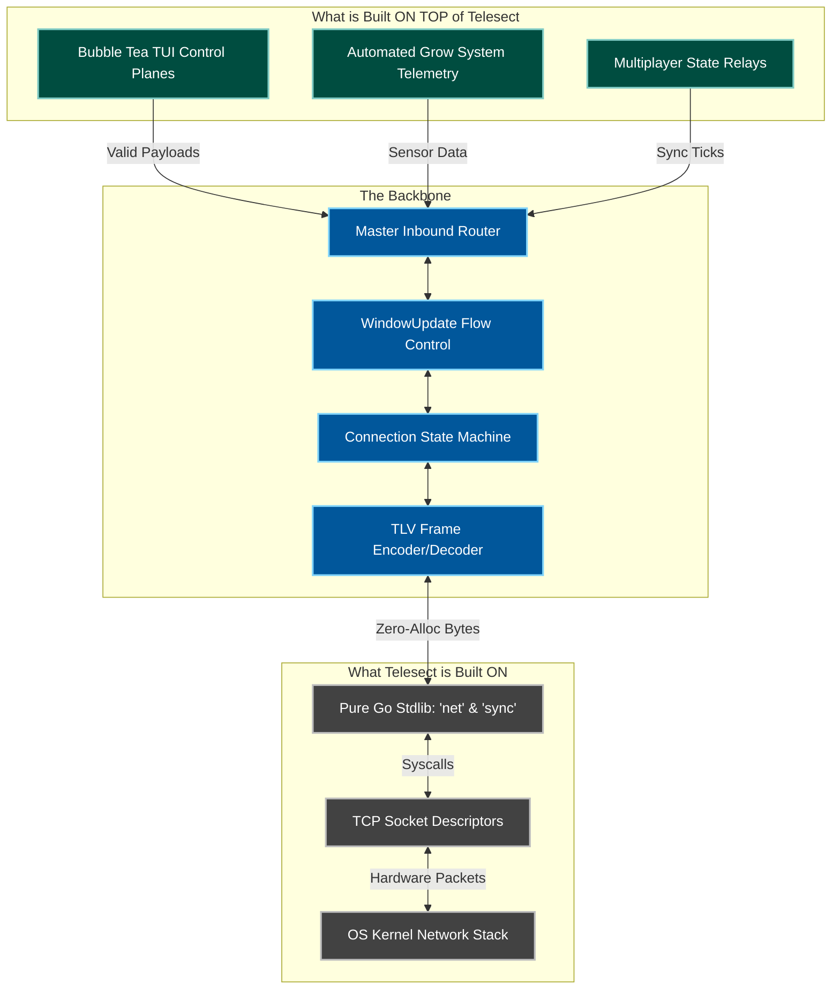

# Architectural Blueprint

Telesect acts as the critical bridge between raw OS infrastructure and high-level distributed applications.

<div style="overflow-x: auto; max-width: 100%;">

</div>
---

## The Core Component Hierarchy

To maintain complete separation of concerns while operating at maximum throughput, Telesect breaks its runtime orchestration into three primary structural layers.

### 1. The Global Orchestrator (The Server)
The `Server` struct handles global state initialization, port binding, and high-capacity backpressure routing. It does not handle direct connection I/O; instead, it acts as a central control hub.

```go
type Server struct {
    addr          string
    listener      net.Listener
    connections   map[string]*Connection
    InboundRouter chan *protocol.Packet
}

```

!!! info "Logistics Hub Analogy"
The **Server** is the main Automated Logistics Hub Facility. It manages the property lines, hosts the master directory board of allowed entities, and operates the main facility conveyor belt (`InboundRouter`) where all processed items are dumped.

### 2. The OS Ingress Gateway (The Listener)

Embedded directly inside the Server, the `net.Listener` interacts directly with the operating system's network stack to block and listen for TCP handshakes.

!!! info "Logistics Hub Analogy"
The **Listener** is the automated physical shipping gate at the edge of the property. It only answers when a truck arrives, opens briefly to let them through, and hands them off to a facility clerk.

### 3. The Session State Machine (The Connection)

The `Connection` struct wraps a single accepted socket. It isolates full-duplex transmission by dividing its workload into two decoupled background routines: an unloader (`ReadLoop`) and a loader (`WriteLoop`).

```go
type Connection struct {
    net.Conn
    SendChan        chan *protocol.Packet
    FlowControlChan chan byte
    readScratch     [5]byte
    writeScratch    [5]byte
}

```

!!! info "Logistics Hub Analogy"
The **Connection** represents an individual Cargo Truck parked inside an assigned loading bay. It contains its own dedicated outbox mailbox (`SendChan`) and a local brake pedal (`FlowControlChan`) to instantly arrest transmission if the hub gets congested.

---

## Data Pipeline & Concurrency Topology

The following map defines how data frames cross execution boundaries between the operating system socket layer and the application routing space:

1. **Ingress:** 
    `net.Listener.Accept()` → Spawns Goroutine → `Server.handleRawStream()`
2. **Read Processing:** 
`Connection.ReadLoop()` → Zero-Allocation Parsing → Intercepts Engine Commands → Streams to `Server.InboundRouter`
3. **Egress Processing:** Application → `Connection.SendChan` → `Connection.WriteLoop()` → Kernel Socket Write

---

## Application-Layer Backpressure (Window Updates)

Telesect avoids memory exhaustion (OOM) under heavy loads by utilizing an asymmetric low/high-water mark system to dynamically throttle clients without severing the underlying TCP socket connection.

| Saturation Metric | Triggered Action | Protocol Wire Signal |
| --- | --- | --- |
| **80% Capacity** (800 Frames) | Global Backpressure Alarm Engaged | `WindowStatePause (0x00)` |
| **20% Capacity** (200 Frames) | Global Backpressure Alarm Cleared | `WindowStateResume (0x01)` |

the `InboundRouter` channel reaches 800 buffered packets, the `monitorBackpressure` worker broadcasts a `TypeWindowUpdate` control frame to all registered connection outboxes. The client's local `WriteLoop` catches this frame and swaps its active channel pointer to `nil`, instantly pausing data ingestion while allowing existing socket buffers to remain completely safe.
